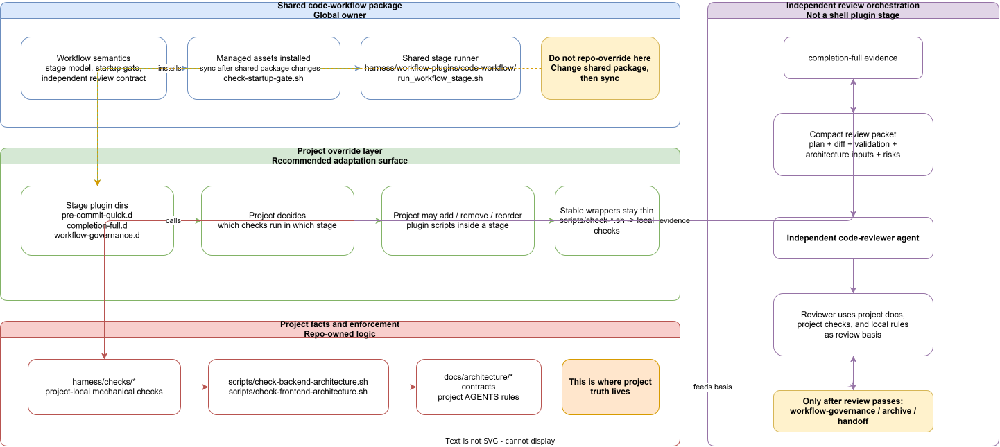

# code-workflow package

This package owns the repo-local assets for the shared `code-workflow`.

Install into a repository:

```bash
bash ~/.agents/harness/workflow-installer.sh <repo-root> code-workflow
```

Sync a repository after the shared package changes:

```bash
bash ~/.agents/harness/workflow-sync.sh <repo-root> code-workflow
```

Check whether a repository still matches this package baseline:

```bash
bash ~/.agents/harness/workflow-sync-check.sh <repo-root> code-workflow
```

The package entrypoint is `workflow.sh`. Callers should prefer the harness-level commands above instead of invoking the package entrypoint directly.

## Override Model

The diagram below only covers where a project should adapt `code-workflow`, and where it should not.



Read it in layers:

1. Shared package owns workflow semantics and managed assets.
2. Projects override through `harness/workflow-plugins/code-workflow/<stage>.d/*.sh`.
3. The project override layer decides plugin sets and execution order.

## Review Chain

The review gate is intentionally a separate orchestration flow, not part of the override diagram above.


Read it in order:

1. `completion-full` produces implementation-context evidence.
2. That evidence is compacted into a review packet.
3. The packet goes to an independent `code-reviewer` agent.
4. The reviewer uses project docs, project checks, and local rules as the basis.
5. Only after review passes does the task enter `workflow-governance` / archive / handoff.

Besides startup-gate and archive assets, the package also owns the shared stage mechanism installed into:

- `harness/workflow-plugins/code-workflow/run_workflow_stage.sh`
- `harness/workflow-plugins/code-workflow/archive_task_artifacts.sh`
- `harness/workflow-plugins/code-workflow/cleanup_task_worktree.sh`
- `harness/workflow-plugins/code-workflow/cleanup_task_worktree.py`

That runner exposes the shared stage names:

- `pre-commit-quick`
- `completion-full`
- `workflow-governance`

Repositories should keep deciding their own plugin sets under:

- `harness/workflow-plugins/code-workflow/<stage>.d/*.sh`

Task-intake order for non-trivial task slices:

1. Run the relevant `superpowers` analysis pass, normally `superpowers:brainstorming`.
2. Then run `grill-with-docs` to look for gaps in scope, docs, assumptions, and owner boundaries.
3. Use that output to finish the implementation plan in Chinese by default.
4. Only then start implementation.

Implementation plans under `docs/plan/impl-plan/` should use Chinese prose by default.
Keep code, commands, paths, error messages, protocol fields, enum values, external proper nouns, and machine-parsed keys unchanged.

Completion order for non-trivial task slices:

1. Run `completion-full` as implementation-context validation.
2. Hand off to an independent `code-reviewer` agent for the real completion gate.
3. Fix material findings and rerun impacted validation when needed.
4. Only then enter `workflow-governance` / doctor / archive / final handoff.

After merge / final integration:

1. Archive task artifacts so the startup gate moves to `ready_to_merge`.
2. Merge the task branch or otherwise integrate the task head.
3. Run `bash harness/workflow-plugins/code-workflow/cleanup_task_worktree.sh` from the integration worktree to safely close the dedicated task worktree. The shell entry delegates to the managed Python helper installed beside it.
4. The cleanup step marks the gate `archived`; dedicated task worktrees are removed only when they are clean and already merged, and the merged `task/<slug>` branch is deleted by default unless you explicitly keep it.

Startup gate status model:

- `active`: the task is still in active implementation / validation.
- `ready_to_merge`: plan/task artifacts are already archived, but the task still owns the current worktree for final commit, merge, or cleanup.
- `archived`: terminal closed state; not treated as an effective current task gate anymore.

The reviewer handoff contract lives at:

```text
~/.agents/harness/workflows/code-workflow/independent-review-protocol.md
```

This package intentionally does not encode reviewer spawning as a shell plugin stage.
The shell runner stays mechanical; the independent reviewer remains an orchestration concern owned by `code-workflow`.
