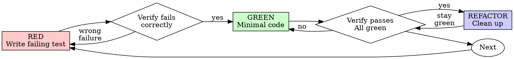

# Test-Driven Development (TDD)

## Overview

Write the test first. Watch it fail. Write minimal code to pass.

**Core principle:** If you didn't watch the test fail, you don't know if it tests the right thing.

**Violating the letter of the rules is violating the spirit of the rules.**

## When to Use

First classify the implementation surface. TDD is mandatory for logic-bearing slices, not for every file edit.

**Always use for:**
- New behavior-bearing features
- Bug fixes with a reproducible behavior or regression
- Refactoring that moves, extracts, or reshapes logic, state ownership, data flow, public contracts, permissions, persistence, or async behavior
- Behavior changes
- Frontend logic changes such as state, validation, derived data, permissions, async flows, stores, composables, reducers, or interaction rules

**Do not default to TDD for:**
- Simple UI or presentation-only work: spacing, color, typography, static layout, copy-only edits, visual polish, or responsive tweaks with no behavior change
- Moving existing controls, labels, or markup between existing UI containers when emitted events, state semantics, permissions, validation, and data flow stay the same
- Mechanical style or template edits where the right verification is typecheck, build, component render, screenshot, or manual UI check rather than a new failing test
- Pure removals, retirements, or cleanup of dead code, unused branches, stale flags, compatibility shims, or unreachable paths when supported behavior, public contracts, and migration guarantees stay the same

For pure removal-only tasks, do not invent a failing test whose only signal is "the deleted thing is gone". Verify with the smallest sufficient check instead: call-site search, existing regression coverage, typecheck/build, targeted runtime checks, or manual validation. If the removal changes supported behavior, public contracts, permissions, state transitions, error handling, or migration semantics, it is a behavior change and TDD applies.

**Exceptions (ask your human partner):**
- Throwaway prototypes
- Generated code
- Configuration files

Thinking "skip TDD just this once"? Stop. That's rationalization.

If a frontend task mixes visual work and logic, split it. Keep TDD for the logic-bearing slice and validate the pure UI slice with the smallest sufficient visual/manual check. If the task is pure UI, say `No TDD` briefly and proceed directly to implementation plus focused verification.

If a task mixes behavior changes with cleanup or removal, split it the same way. Keep TDD on the behavior-changing slice; verify the pure removal slice with focused non-TDD checks.

## The Iron Law

For TDD-required slices:

```
NO PRODUCTION CODE WITHOUT A FAILING TEST FIRST
```

Write code before the test? Delete it. Start over.

**No exceptions:**
- Don't keep it as "reference"
- Don't "adapt" it while writing tests
- Don't look at it
- Delete means delete

Implement fresh from tests. Period.

## Red-Green-Refactor



### RED - Write Failing Test

Write one minimal test showing what should happen.

<Good>
```typescript
test('retries failed operations 3 times', async () => {
  let attempts = 0;
  const operation = () => {
    attempts++;
    if (attempts < 3) throw new Error('fail');
    return 'success';
  };

  const result = await retryOperation(operation);

  expect(result).toBe('success');
  expect(attempts).toBe(3);
});
```
Clear name, tests real behavior, one thing
</Good>

<Bad>
```typescript
test('retry works', async () => {
  const mock = jest.fn()
    .mockRejectedValueOnce(new Error())
    .mockRejectedValueOnce(new Error())
    .mockResolvedValueOnce('success');
  await retryOperation(mock);
  expect(mock).toHaveBeenCalledTimes(3);
});
```
Vague name, tests mock not code
</Bad>

**Requirements:**
- One behavior
- Clear name
- Real code (no mocks unless unavoidable)

### Verify RED - Watch It Fail

**MANDATORY. Never skip.**

```bash
npm test path/to/test.test.ts
```

Confirm:
- Test fails (not errors)
- Failure message is expected
- Fails because feature missing (not typos)

**Test passes?** You're testing existing behavior. Fix test.

**Test errors?** Fix error, re-run until it fails correctly.

### GREEN - Minimal Code

Write simplest code to pass the test.

<Good>
```typescript
async function retryOperation<T>(fn: () => Promise<T>): Promise<T> {
  for (let i = 0; i < 3; i++) {
    try {
      return await fn();
    } catch (e) {
      if (i === 2) throw e;
    }
  }
  throw new Error('unreachable');
}
```
Just enough to pass
</Good>

<Bad>
```typescript
async function retryOperation<T>(
  fn: () => Promise<T>,
  options?: {
    maxRetries?: number;
    backoff?: 'linear' | 'exponential';
    onRetry?: (attempt: number) => void;
  }
): Promise<T> {
  // YAGNI
}
```
Over-engineered
</Bad>

Don't add features, refactor other code, or "improve" beyond the test.

### Verify GREEN - Watch It Pass

**MANDATORY.**

```bash
npm test path/to/test.test.ts
```

Confirm:
- Test passes
- Other tests still pass
- Output pristine (no errors, warnings)

**Test fails?** Fix code, not test.

**Other tests fail?** Fix now.

### REFACTOR - Clean Up

After green only:
- Remove duplication
- Improve names
- Extract helpers
- Refactor test code when it becomes harder to read than the behavior it proves

Keep tests green. Don't add behavior.

## Test Suite Growth

TDD grows the test suite on purpose. It should not grow one catch-all file forever.
Tests created during TDD are maintained behavior specifications and regression guards, not disposable scaffolding. Do not delete them just because implementation is complete; delete or merge tests only when their behavior signal is intentionally retired, duplicated by a clearer test, or moved to a better owner/layer.

During REFACTOR, treat tests as maintained code:

- Split tests by behavior or use case when one file starts covering unrelated workflows.
- Prefer behavior-focused files such as `register-user.spec.ts`, `password-reset.spec.ts`, or `invoice-payment_test.go` over one giant class/module test.
- Use builders, fixtures, and domain assertions after duplication appears. Keep helpers local until more than one file needs them.
- Use table tests only for multiple examples of the same rule. Do not hide different behaviors in one table.
- Delete or merge tests that provide the same failure signal as another test.
- Keep setup focused on fields and collaborators that matter to the behavior under test.
- Avoid testing private implementation details just because they are easy to reach.

Frontend TDD:

- Use TDD for state, validation, derived data, permissions, async flows, stores, composables, reducers, and interaction rules.
- Prefer testing the smallest owner of the behavior: composable, store, reducer, route-workflow helper, or component interaction.
- Do not use snapshot-only tests as the red step for behavior changes.
- If a task mixes visual styling and logic, write failing tests for the logic-bearing slice and validate the visual slice separately.

Backend TDD:

- Use TDD for handlers, services/use cases, repositories, jobs, queues, caching behavior, integrations, permissions, idempotency, and persistence rules.
- Put each test at the boundary that owns the behavior. Do not duplicate the same rule across handler, service, repository, and end-to-end tests unless each level proves a distinct contract.
- Keep integration fixtures reusable and explicit. Schema setup belongs in test helpers or migrations, not ad hoc per-test boilerplate.
- Prefer one clear behavior assertion over broad mock-call verification.

### Repeat

Next failing test for next feature.

## Good Tests

| Quality | Good | Bad |
|---------|------|-----|
| **Minimal** | One thing. "and" in name? Split it. | `test('validates email and domain and whitespace')` |
| **Clear** | Name describes behavior | `test('test1')` |
| **Shows intent** | Demonstrates desired API | Obscures what code should do |

## Why Order Matters

**"I'll write tests after to verify it works"**

Tests written after code pass immediately. Passing immediately proves nothing:
- Might test wrong thing
- Might test implementation, not behavior
- Might miss edge cases you forgot
- You never saw it catch the bug

Test-first forces you to see the test fail, proving it actually tests something.

**"I already manually tested all the edge cases"**

Manual testing is ad-hoc. You think you tested everything but:
- No record of what you tested
- Can't re-run when code changes
- Easy to forget cases under pressure
- "It worked when I tried it" ≠ comprehensive

Automated tests are systematic. They run the same way every time.

**"Deleting X hours of work is wasteful"**

Sunk cost fallacy. The time is already gone. Your choice now:
- Delete and rewrite with TDD (X more hours, high confidence)
- Keep it and add tests after (30 min, low confidence, likely bugs)

The "waste" is keeping code you can't trust. Working code without real tests is technical debt.

**"TDD is dogmatic, being pragmatic means adapting"**

TDD IS pragmatic:
- Finds bugs before commit (faster than debugging after)
- Prevents regressions (tests catch breaks immediately)
- Documents behavior (tests show how to use code)
- Enables refactoring (change freely, tests catch breaks)

"Pragmatic" shortcuts = debugging in production = slower.

**"Tests after achieve the same goals - it's spirit not ritual"**

No. Tests-after answer "What does this do?" Tests-first answer "What should this do?"

Tests-after are biased by your implementation. You test what you built, not what's required. You verify remembered edge cases, not discovered ones.

Tests-first force edge case discovery before implementing. Tests-after verify you remembered everything (you didn't).

30 minutes of tests after ≠ TDD. You get coverage, lose proof tests work.

## Common Rationalizations

| Excuse | Reality |
|--------|---------|
| "Too simple to test" | Simple code breaks. Test takes 30 seconds. |
| "I'll test after" | Tests passing immediately prove nothing. |
| "Tests after achieve same goals" | Tests-after = "what does this do?" Tests-first = "what should this do?" |
| "Already manually tested" | Ad-hoc ≠ systematic. No record, can't re-run. |
| "Deleting X hours is wasteful" | Sunk cost fallacy. Keeping unverified code is technical debt. |
| "Keep as reference, write tests first" | You'll adapt it. That's testing after. Delete means delete. |
| "Need to explore first" | Fine. Throw away exploration, start with TDD. |
| "Test hard = design unclear" | Listen to test. Hard to test = hard to use. |
| "TDD will slow me down" | TDD faster than debugging. Pragmatic = test-first. |
| "Manual test faster" | Manual doesn't prove edge cases. You'll re-test every change. |
| "Existing code has no tests" | You're improving it. Add tests for existing code. |

## Red Flags - STOP and Start Over

- Code before test
- Test after implementation
- Test passes immediately
- Can't explain why test failed
- Tests added "later"
- Rationalizing "just this once"
- "I already manually tested it"
- "Tests after achieve the same purpose"
- "It's about spirit not ritual"
- "Keep as reference" or "adapt existing code"
- "Already spent X hours, deleting is wasteful"
- "TDD is dogmatic, I'm being pragmatic"
- "This is different because..."

**All of these mean: Delete code. Start over with TDD.**

## Example: Bug Fix

**Bug:** Empty email accepted

**RED**
```typescript
test('rejects empty email', async () => {
  const result = await submitForm({ email: '' });
  expect(result.error).toBe('Email required');
});
```

**Verify RED**
```bash
$ npm test
FAIL: expected 'Email required', got undefined
```

**GREEN**
```typescript
function submitForm(data: FormData) {
  if (!data.email?.trim()) {
    return { error: 'Email required' };
  }
  // ...
}
```

**Verify GREEN**
```bash
$ npm test
PASS
```

**REFACTOR**
Extract validation for multiple fields if needed.

## Verification Checklist

Use this checklist only after the scope has been classified as TDD-required.

Before marking work complete:

- [ ] Every new function/method has a test
- [ ] Watched each test fail before implementing
- [ ] Each test failed for expected reason (feature missing, not typo)
- [ ] Wrote minimal code to pass each test
- [ ] All tests pass
- [ ] Output pristine (no errors, warnings)
- [ ] Tests use real code (mocks only if unavoidable)
- [ ] Edge cases and errors covered

Can't check all boxes? You skipped TDD. Start over.

## When Stuck

| Problem | Solution |
|---------|----------|
| Don't know how to test | Write wished-for API. Write assertion first. Ask your human partner. |
| Test too complicated | Design too complicated. Simplify interface. |
| Must mock everything | Code too coupled. Use dependency injection. |
| Test setup huge | Extract helpers. Still complex? Simplify design. |

## Debugging Integration

Bug found? Write failing test reproducing it. Follow TDD cycle. Test proves fix and prevents regression.

Never fix bugs without a test.

## Testing Anti-Patterns

When adding mocks or test utilities, read @testing-anti-patterns.md to avoid common pitfalls:
- Testing mock behavior instead of real behavior
- Adding test-only methods to production classes
- Mocking without understanding dependencies

## Final Rule

```
TDD-required production behavior code → test exists and failed first
Pure removal / retirement / no-behavior-change cleanup → smallest sufficient non-TDD verification
Otherwise → classify the slice before choosing
```

No exceptions for TDD-required slices without your human partner's permission. Pure UI / presentation-only work and pure removal-only cleanup are outside this skill's default scope and should be verified with the smallest sufficient non-TDD check.
